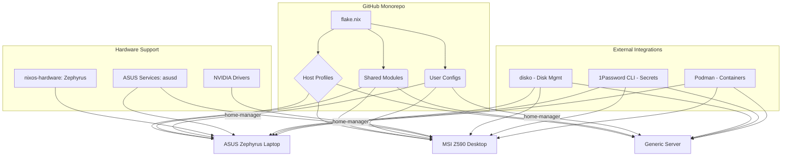
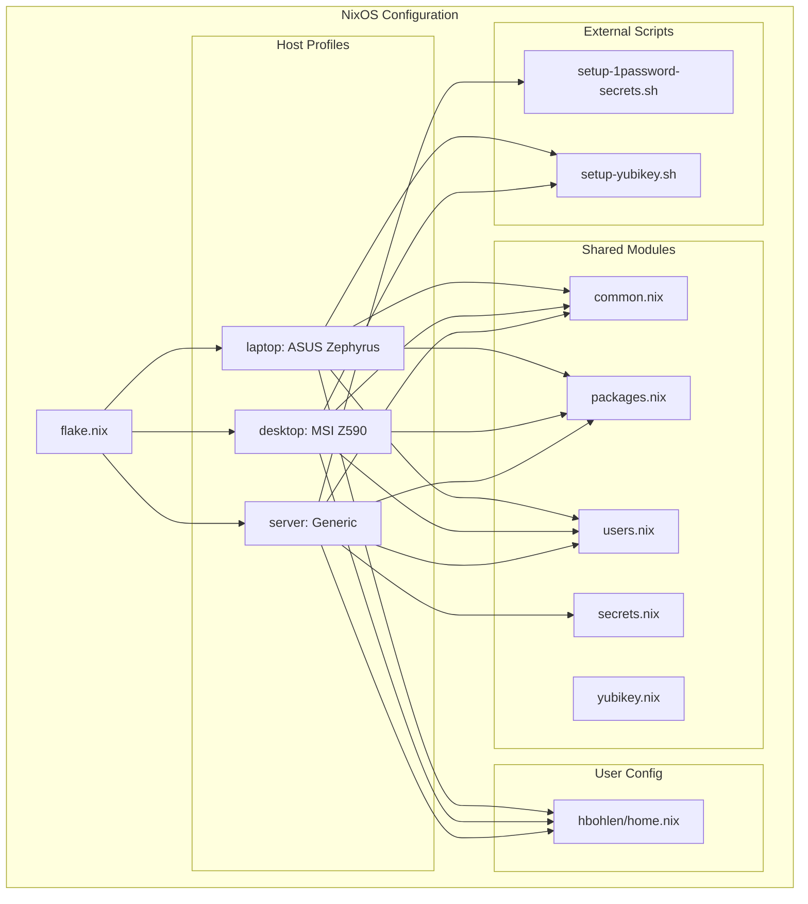
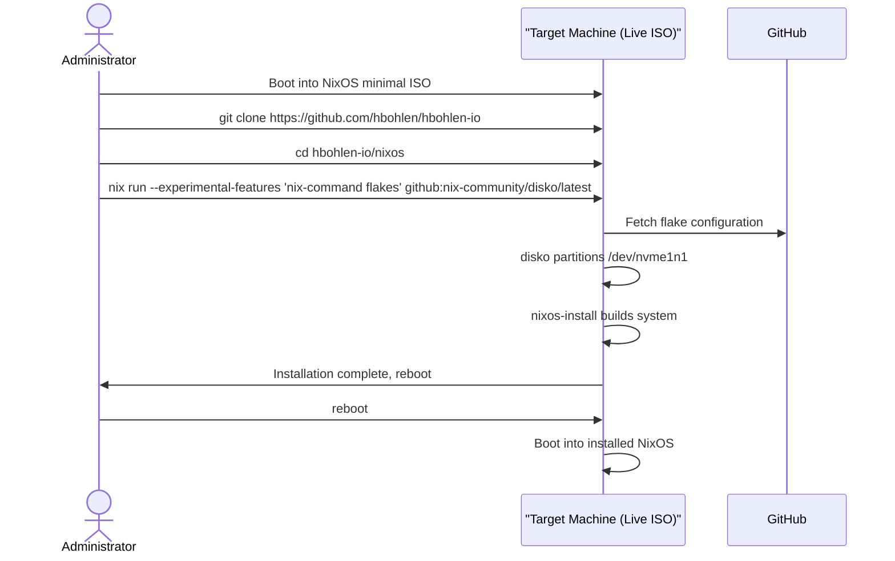
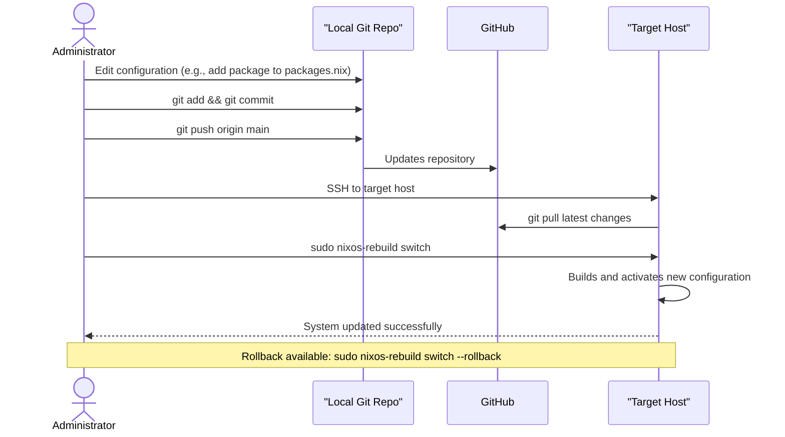
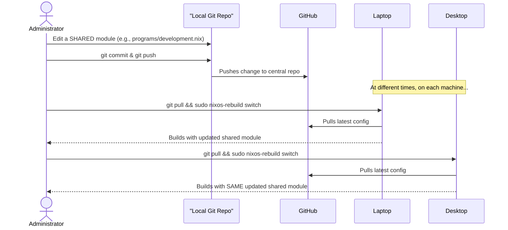

# Hayden's NixOS Configuration Architecture

## 1. Introduction

This document outlines the current architecture for Hayden's NixOS Configuration project. It describes the implemented system that provides declarative, reproducible infrastructure management across desktop, laptop, and server environments. The architecture emphasizes modularity, security, and maintainability for personal computing infrastructure.

### Project Evolution
The project began as a brownfield enhancement (converting existing Ubuntu installation to NixOS) and has evolved into a comprehensive multi-host configuration system. Current implementation includes completed Epics 1-3 with Epic 4 (CI/CD automation) in planning.

### Change Log
| Date | Version | Description | Author |
| :--- | :--- | :--- | :--- |
| 2025-09-15 | 1.0 | Initial architecture draft | Winston (Architect) |
| 2025-01-17 | 2.0 | Updated for current implementation state | Claude (Architect) |

---
## 2. High Level Architecture

### Technical Summary
The system is a production-ready declarative monorepo built on NixOS, utilizing Flakes for hermetic dependency management. It includes fully implemented host-specific profiles (ASUS Zephyrus laptop, MSI Z590 desktop, generic server), modular shared components, and home-manager user configurations. Key patterns include hardware abstraction, declarative disk management via disko, and secure secrets handling through 1Password CLI integration.

### Current Implementation Status
* **Completed Epics**: 1-3 (Foundational setup, Desktop config, Server deployment)
* **Active Development**: Epic 4 (CI/CD automation) - planned
* **Host Coverage**: Laptop (ASUS Zephyrus M16), Desktop (MSI Z590), Server (generic)
* **Secrets Management**: 1Password CLI with automated retrieval
* **Container Runtime**: Podman with Docker API compatibility

### High Level Overview
* **Architectural Style**: **Implemented Declarative Configuration** - All systems are fully defined in code with reproducible builds
* **Repository Structure**: **Active Monorepo** with modular organization and version control
* **Primary Data Flow**: Root flake.nix orchestrates host configurations, each composing shared modules with hardware-specific overrides
* **Key Architectural Decisions**:
    * **Nix Flakes**: Provides hermetic, reproducible builds with version pinning
    * **disko**: Enables declarative disk partitioning and automated installation
    * **home-manager**: Ensures consistent user environments across hosts
    * **1Password CLI**: Secure, user-friendly secrets management without complex key infrastructure

### Current System Architecture Diagram


### Architectural and Design Patterns
* **Modular Configuration**: System definitions are broken into small, reusable Nix modules that can be composed to build a complete system.
* **Separation of Concerns (Hardware vs. Software)**: Host configurations are explicitly divided between modules that define the software environment and modules that define hardware-specific needs.
* **Declarative State Management**: Every aspect of the system is defined declaratively in Nix files.

### Current Risks and Mitigation Strategies
* **Hardware Compatibility**: ASUS-specific services and kernel parameters may require updates with hardware changes. **Mitigation**: Modular hardware configuration with clear documentation of ASUS-specific requirements.
* **Secrets Management Dependency**: 1Password CLI availability affects automated deployments. **Mitigation**: Graceful fallback to manual secret entry, comprehensive documentation of 1Password setup process.
* **NVIDIA Driver Updates**: Graphics driver changes can break desktop functionality. **Mitigation**: Pin specific driver versions, maintain backup kernel parameters, test graphics switching thoroughly.
* **Multi-Host Configuration Drift**: Changes to shared modules may have unintended effects across hosts. **Mitigation**: Comprehensive testing of all host configurations before deployment, maintain separate branches for host-specific changes.

### Analysis of Diagram Flow and Dependencies
The logical flow is one of **composition and specialization**. We start with a single root (`flake.nix`), define shared building blocks (`Shared Modules`, `User Configs`), and then compose them into specific `Host Profiles`, layering on hardware details and specialized tools only where required. This flow ensures maximum reusability and a clear dependency chain.

---
## 3. Tech Stack

### Infrastructure Scope
* **Deployment Target**: Local/personal infrastructure (laptop, desktop, home server)
* **No Cloud Dependencies**: All systems run on local hardware
* **Hardware Focus**: ASUS motherboard compatibility, NVIDIA graphics, general server requirements

### Current Technology Stack
| Category | Technology | Version | Status | Purpose | Rationale |
| :--- | :--- | :--- | :--- | :--- | :--- |
| OS / Language | NixOS / Nix | Unstable | ✅ Implemented | Declarative OS & package management | Core platform providing reproducibility |
| Config Mgmt | Nix Flakes | Latest | ✅ Implemented | Hermetic builds & dependency mgmt | Enables version-pinned, reproducible configurations |
| User Env Mgmt | Home Manager | Latest | ✅ Implemented | Declarative user environments | Consistent user experience across hosts |
| Disk Mgmt | `disko` | Latest | ✅ Implemented | Declarative partitioning | Automated, reproducible disk setup |
| Secrets Mgmt | 1Password CLI | Latest | ✅ Implemented | Secure credential management | User-friendly secrets without complex key infrastructure |
| Hardware Support | nixos-hardware | Latest | ✅ Implemented | ASUS hardware compatibility | Optimized configurations for specific hardware |
| Container Runtime | Podman | Latest | ✅ Implemented | Application containers | Rootless containers with Docker API compatibility |
| Version Control | Git | Latest | ✅ Implemented | Configuration versioning | Full history of system changes |
| CI/CD | GitHub Actions | Latest | 🚧 Planned | Automated validation | Epic 4 implementation for testing automation |

---
## 4. Data Models

### Host Configuration
* **Purpose**: Defines a complete, buildable machine configuration for specific hardware
* **Attributes**: `hostname`, `system`, `hardwareModules`, `sharedModules`, `userConfig`, `diskLayout`
* **Relationships**: Each host imports shared modules, hardware-specific modules, and user configurations

### User Environment
* **Purpose**: Manages user accounts and home directory configurations via home-manager
* **Attributes**: `username`, `groups`, `initialPassword`, `homeConfig`, `packages`
* **Relationships**: User configurations are shared across compatible hosts with host-specific overrides

### Shared Module
* **Purpose**: Reusable configuration components that work across multiple hosts
* **Attributes**: `name`, `services`, `packages`, `systemConfig`
* **Examples**: `common.nix` (base system), `packages.nix` (shared tools), `users.nix` (account setup)

### Secrets Configuration
* **Purpose**: Manages sensitive data retrieval and system integration
* **Attributes**: `secretType`, `source` (1Password), `targetPath`, `permissions`
* **Implementation**: 1Password CLI integration with YAML-based secret definitions

---
## 5. Components

### Host Configurations
* **Responsibility**: Defines complete system configurations for each target machine
* **Structure**: `hosts/{laptop,desktop,server}/` with `configuration.nix` and `disko.nix`
* **Interfaces**: Available as `nixosConfigurations.<hostname>` in flake outputs

### Shared Modules
* **Responsibility**: Provides reusable configuration components across all hosts
* **Current Modules**:
  - `common.nix`: Base system configuration (GNOME, networking, security)
  - `packages.nix`: System-wide packages (development tools, YubiKey support)
  - `users.nix`: User account configuration
  - `secrets.nix`: Secret management framework
  - `yubikey.nix`: YubiKey authentication support

### User Management
* **Responsibility**: Manages user environments and home directory configurations
* **Structure**: `users/hbohlen/` with `home.nix` for home-manager configuration
* **Integration**: Applied to all hosts via flake configuration

### Secrets Management
* **Responsibility**: Handles secure credential management across hosts
* **Implementation**: 1Password CLI integration with automated secret retrieval
* **Security**: No secrets stored in repository, runtime retrieval only

### Current Component Architecture


---
## 6. Core Workflows

### Workflow 1: System Installation (Implemented)


### Workflow 2: System Updates (Implemented)


### Workflow 3: Updating a Shared Module


---
## 7. Source Tree

```plaintext
hbohlen-io/
├── nixos/
│   ├── flake.nix
│   ├── flake.lock
│   ├── hosts/
│   │   ├── laptop/
│   │   │   ├── configuration.nix
│   │   │   └── disko.nix
│   │   ├── desktop/
│   │   │   ├── configuration.nix
│   │   │   └── disko.nix
│   │   └── server/
│   │       ├── configuration.nix
│   │       └── disko.nix
│   ├── modules/
│   │   ├── common.nix
│   │   ├── packages.nix
│   │   ├── users.nix
│   │   ├── secrets.nix
│   │   └── yubikey.nix
│   └── users/
│       └── hbohlen/
│           └── home.nix
├── docs/
│   ├── architecture.md
│   ├── prd/
│   ├── stories/
│   └── qa/
├── scripts/
│   ├── setup-1password-secrets.sh
│   ├── setup-yubikey.sh
│   └── test-yubikey.sh
└── .github/
    └── workflows/
        ├── test-desktop-install.yml
        └── test-disko-install.yml
```

---
## 8. Infrastructure and Deployment
The system uses NixOS configurations as Infrastructure as Code. Deployment follows a git-based workflow:

- **Initial Installation**: `disko-install` for partitioning and system setup
- **Updates**: `git pull` + `sudo nixos-rebuild switch` on target hosts
- **Rollbacks**: `sudo nixos-rebuild switch --rollback` for immediate reversion
- **Validation**: GitHub Actions CI/CD for configuration testing

All infrastructure runs on local hardware with no cloud dependencies.

---
## 9. Error Handling Strategy
Error handling relies on NixOS's robust mechanisms:

- **Build-Time Validation**: Nix evaluator catches configuration errors before deployment
- **Atomic Updates**: `nixos-rebuild switch` either succeeds completely or fails safely
- **Instant Rollback**: `nixos-rebuild switch --rollback` reverts to previous working state
- **Systemd Logging**: All service errors logged to `journalctl`
- **Git History**: Complete configuration history for troubleshooting

No centralized observability platform is currently implemented.

---
## 10. Coding Standards
- **Formatting**: Use `nixpkgs-fmt` for consistent code formatting
- **Modularity**: Shared modules contain only common functionality
- **Hardware Separation**: Host-specific configurations override shared defaults
- **Documentation**: All modules include inline comments explaining purpose
- **Version Control**: Every configuration change committed with descriptive messages

---
## 11. Test Strategy and Standards
Current testing approach:

- **Configuration Validation**: `nix flake check` ensures syntax correctness
- **Build Testing**: `nix build` verifies all dependencies resolve
- **CI/CD Validation**: GitHub Actions test configuration builds
- **Manual Testing**: Hardware-specific testing after automated validation
- **Integration Testing**: End-to-end testing on target hardware

Future Epic 4 will implement automated VM testing.

---
## 12. Security
Security implementation includes:

- **User Management**: Single administrator account with sudo access
- **Secrets Management**: 1Password CLI for secure credential handling
- **Disk Encryption**: LUKS encryption on swap partitions
- **Service Security**: SSH with password authentication disabled
- **Hardware Security**: YubiKey integration for multi-factor authentication
- **Firewall**: Default NixOS firewall configuration

---
## 13. Next Steps
**Current Status**: Epics 1-3 completed, desktop installation ready for testing.

**Immediate Next Steps**:
1. Complete desktop installation and validation
2. Test multi-host configuration consistency
3. Begin Epic 4: CI/CD automation implementation
4. Document hardware-specific lessons learned

**Future Enhancements**:
- Automated VM testing in CI/CD
- Multi-host secrets synchronization
- Advanced monitoring and alerting
- Performance optimization and tuning

---
## Implementation Status

### Completed Components
* **Host Configurations**: Laptop (ASUS Zephyrus), Desktop (MSI Z590), Server (Generic)
* **Shared Modules**: Common system config, packages, users, secrets, YubiKey support
* **Secrets Management**: 1Password CLI integration with automated retrieval
* **Hardware Support**: ASUS motherboard services, NVIDIA graphics, multi-monitor setup
* **Container Runtime**: Podman with Docker API compatibility
* **CI/CD Foundation**: GitHub Actions workflows for configuration validation

### Tested Workflows
* **System Installation**: disko-install process validated on laptop
* **Configuration Updates**: nixos-rebuild switch tested across hosts
* **Secrets Integration**: 1Password CLI setup and retrieval working
* **Hardware Compatibility**: ASUS services and NVIDIA drivers functional

### Current Architecture Health
* **Modularity**: ✅ High - clean separation between shared and host-specific config
* **Maintainability**: ✅ Good - declarative approach enables easy modifications
* **Reproducibility**: ✅ Excellent - identical systems built from same configuration
* **Security**: ✅ Strong - secrets management and access controls implemented
* **Scalability**: ✅ Good - framework supports additional hosts and services

### AI Implementation Readiness
The readiness for AI agent implementation is **High**. The declarative nature of the project, combined with the clear Source Tree, explicit Coding Standards, and modular design, provides a structured environment where an AI agent can effectively and safely make modifications.
