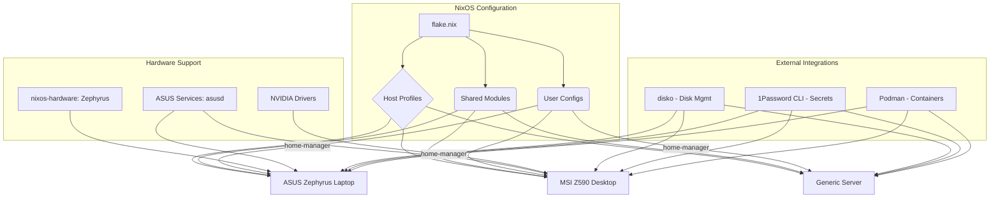

# 2. High Level Architecture

## Technical Summary
The system is a production-ready declarative monorepo built on NixOS, utilizing Flakes for hermetic dependency management. It includes fully implemented host-specific profiles (ASUS Zephyrus laptop, MSI Z590 desktop, generic server), modular shared components, and home-manager user configurations. Key patterns include hardware abstraction, declarative disk management via disko, and secure secrets handling through 1Password CLI integration.

## Current Implementation Status
* **Completed Epics**: 1-3 (Foundational setup, Desktop config, Server deployment)
* **Active Development**: Epic 4 (CI/CD automation) - planned
* **Host Coverage**: Laptop (ASUS Zephyrus M16), Desktop (MSI Z590), Server (generic)
* **Secrets Management**: 1Password CLI with automated retrieval
* **Container Runtime**: Podman with Docker API compatibility

## High Level Overview
* **Architectural Style**: **Implemented Declarative Configuration** - All systems are fully defined in code with reproducible builds
* **Repository Structure**: **Active Monorepo** with modular organization and version control
* **Primary Data Flow**: Root flake.nix orchestrates host configurations, each composing shared modules with hardware-specific overrides
* **Key Architectural Decisions**:
    * **Nix Flakes**: Provides hermetic, reproducible builds with version pinning
    * **disko**: Enables declarative disk partitioning and automated installation
    * **home-manager**: Ensures consistent user environments across hosts
    * **1Password CLI**: Secure, user-friendly secrets management without complex key infrastructure

## Current System Architecture Diagram

## Architectural and Design Patterns
* **Modular Configuration**: System definitions are broken into small, reusable Nix modules that can be composed to build a complete system.
* **Hardware Abstraction**: Host configurations override shared defaults with hardware-specific settings.
* **Declarative State Management**: Every aspect of the system is defined declaratively in Nix files.
* **Version-Controlled Infrastructure**: Complete system history through git commits.

## Current Risks and Mitigation Strategies
* **Hardware Compatibility**: ASUS-specific services and kernel parameters may require updates with hardware changes. **Mitigation**: Modular hardware configuration with clear documentation of ASUS-specific requirements.
* **Secrets Management Dependency**: 1Password CLI availability affects automated deployments. **Mitigation**: Graceful fallback to manual secret entry, comprehensive documentation of 1Password setup process.
* **NVIDIA Driver Updates**: Graphics driver changes can break desktop functionality. **Mitigation**: Pin specific driver versions, maintain backup kernel parameters, test graphics switching thoroughly.
* **Multi-Host Configuration Drift**: Changes to shared modules may have unintended effects across hosts. **Mitigation**: Comprehensive testing of all host configurations before deployment, maintain separate branches for host-specific changes.

## Analysis of Diagram Flow and Dependencies
The logical flow is one of **composition and specialization**. We start with a single root (`flake.nix`), define shared building blocks (`Shared Modules`, `User Configs`), and then compose them into specific `Host Profiles`, layering on hardware details and specialized tools only where required. This flow ensures maximum reusability and a clear dependency chain.

---