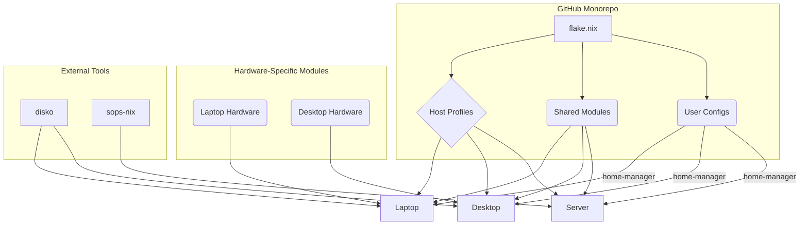

# 2. High Level Architecture

## Technical Summary
The system's architecture is a declarative monorepo built on the NixOS ecosystem, utilizing Flakes for hermetic dependency management. It is composed of modular components, including distinct host-specific profiles (laptop, desktop, servers), reusable shared modules for common software, and user-level configurations managed by `home-manager`. Key architectural patterns include a strict separation of hardware-specific concerns from general software configuration, declarative disk management via `disko`, and secure secret handling with `sops-nix`. This approach directly supports the PRD's primary goals of achieving a reproducible, consistent, and rapidly provisioned environment across multiple machines.

## High Level Overview
* **Architectural Style**: The system employs a **Declarative Configuration** model, where the desired state of each machine is explicitly defined in code, and the Nix tooling is responsible for realizing that state.
* **Repository Structure**: As specified in the PRD, the project will use a **Monorepo** structure to house all configurations for all target machines in a single version-controlled repository.
* **Primary Data Flow**: The primary flow begins with the root `flake.nix`, which imports host-specific configurations. Each host configuration then composes shared modules and its own unique hardware settings to produce a final, bootable system derivation.
* **Key Architectural Decisions**:
    * **Nix Flakes**: Chosen for providing hermetic, reproducible builds and managing all dependencies.
    * **`disko` for Disk Management**: Enables fully declarative and automated partitioning.
    * **`home-manager` Integration**: Ensures the entire user environment is reproducible.

## High Level Project Diagram

## Architectural and Design Patterns
* **Modular Configuration**: System definitions are broken into small, reusable Nix modules that can be composed to build a complete system.
* **Separation of Concerns (Hardware vs. Software)**: Host configurations are explicitly divided between modules that define the software environment and modules that define hardware-specific needs.
* **Declarative State Management**: Every aspect of the system is defined declaratively in Nix files.

## Known Risks and Mitigation Strategies
* **Complexity Creep**: The "from scratch" approach requires discipline to prevent creating an overly complex web of custom modules. **Mitigation**: Adherence to the defined component structure and coding standards is critical.
* **Secret Management Brittleness**: `sops-nix` introduces a dependency on key management. **Mitigation**: The process for onboarding new machines and users to the secret management system must be thoroughly documented in the `README.md`.
* **Hardware-Specific Divergence**: Solutions for specific hardware (like the ASUS laptop) may require complex overrides. **Mitigation**: Keep hardware modules as isolated as possible and favor configuration flags over complex conditional logic in shared modules.
* **Flake Update Burden**: Updating flake inputs like `nixpkgs` can cause a cascade of build failures. **Mitigation**: Updates should be done on a separate branch and thoroughly tested via the VM strategy before being merged.

## Analysis of Diagram Flow and Dependencies
The logical flow is one of **composition and specialization**. We start with a single root (`flake.nix`), define shared building blocks (`Shared Modules`, `User Configs`), and then compose them into specific `Host Profiles`, layering on hardware details and specialized tools only where required. This flow ensures maximum reusability and a clear dependency chain.

---