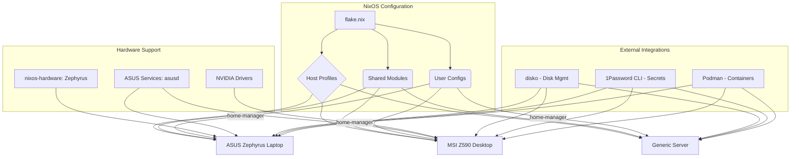

# 5. Components

## Host Configurations
* **Responsibility**: Defines complete system configurations for each target machine
* **Structure**: `hosts/{laptop,desktop,server}/` with `configuration.nix` and `disko.nix`
* **Interfaces**: Available as `nixosConfigurations.<hostname>` in flake outputs

## Shared Modules
* **Responsibility**: Provides reusable configuration components across all hosts
* **Current Modules**:
  - `common.nix`: Base system configuration (GNOME, networking, security)
  - `packages.nix`: System-wide packages (development tools, YubiKey support)
  - `users.nix`: User account configuration
  - `secrets.nix`: Secret management framework
  - `yubikey.nix`: YubiKey authentication support

## User Management
* **Responsibility**: Manages user environments and home directory configurations
* **Structure**: `users/hbohlen/` with `home.nix` for home-manager configuration
* **Integration**: Applied to all hosts via flake configuration

## Secrets Management
* **Responsibility**: Handles secure credential management across hosts
* **Implementation**: 1Password CLI integration with automated secret retrieval
* **Security**: No secrets stored in repository, runtime retrieval only

## Current Component Architecture

---