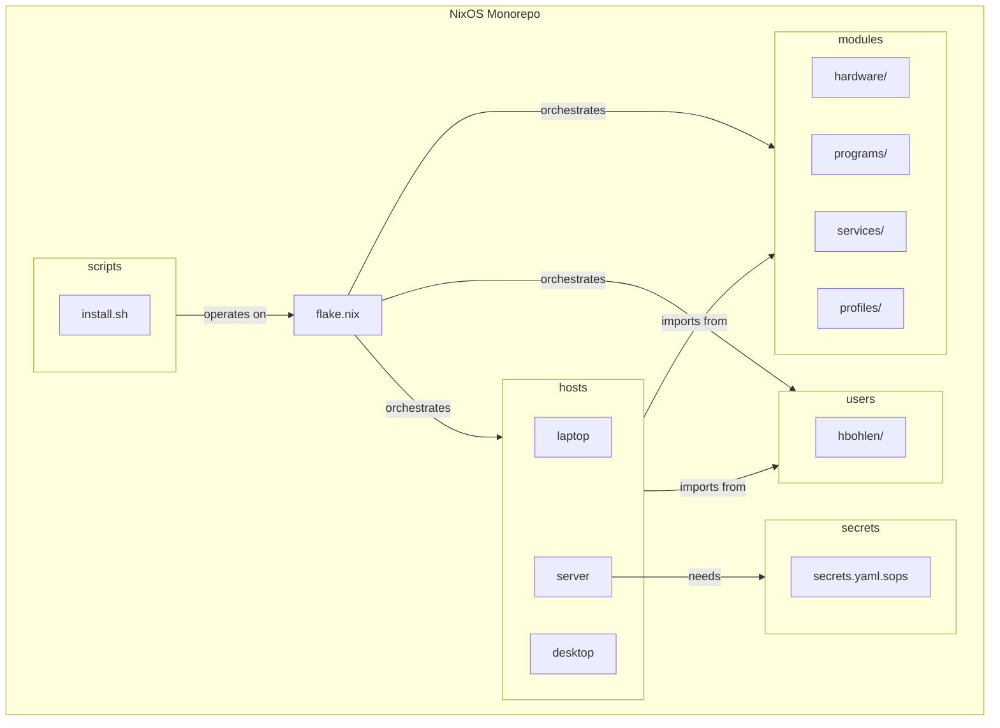

# 5. Components

## Hosts Component
* **Responsibility**: Contains the top-level, final configurations for each target machine.
* **Interfaces**: Exposes a `nixosConfigurations.<hostname>` output in the root `flake.nix`.

## Modules Component
* **Responsibility**: The core library containing all reusable and specialized units of configuration.
* **Sub-Components**: Organized into `hardware/`, `programs/`, `services/`, and `profiles/`.

## Users Component
* **Responsibility**: Contains all user-specific configurations, managed by Home Manager.

## Secrets Component
* **Responsibility**: Manages all encrypted sensitive data for the system using `sops-nix`.

## Scripts Component
* **Responsibility**: Contains operational and automation scripts like `install.sh`.

## Component Diagram

---