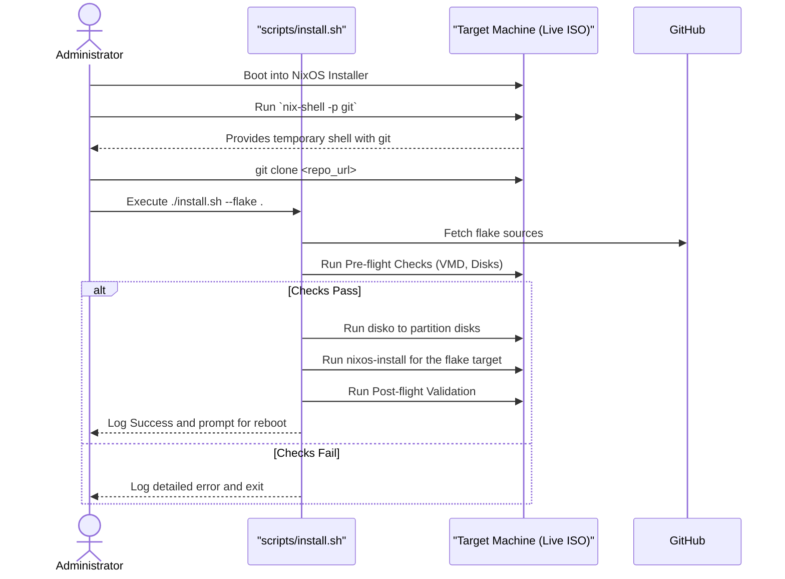
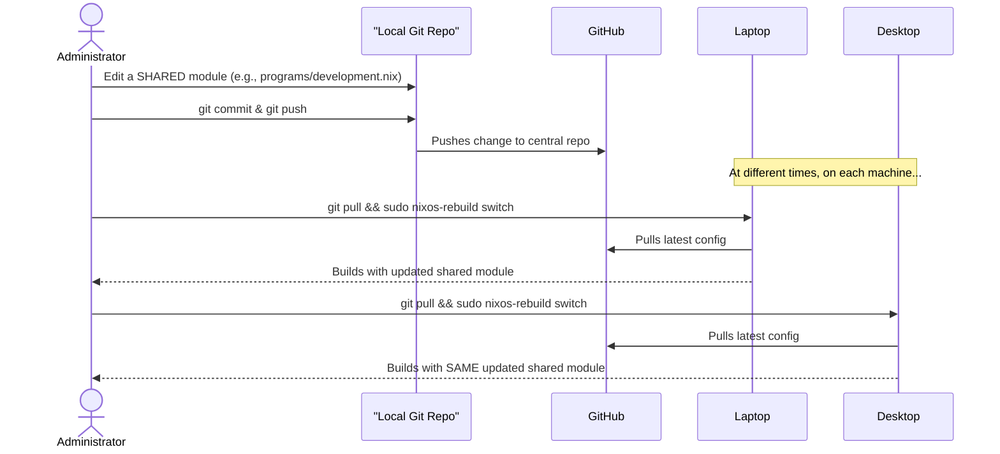

# 6. Core Workflows

## Workflow 1: New Machine Installation


## Workflow 2: System Update and Rollback
```mermaid
sequenceDiagram
    actor Administrator
    participant LocalRepo as "Local Git Repo"
    participant GitHub
    participant TargetHost as "Target Host (e.g., Laptop)"

    Administrator->>LocalRepo: Edit Nix configuration
    Administrator->>LocalRepo: git commit & git push
    LocalRepo->>GitHub: Pushes changes

    Administrator->>TargetHost: SSH into machine

    par Update and Rollback
        section Update Process
            TargetHost->>GitHub: git pull
            Administrator->>TargetHost: sudo nixos-rebuild switch
            TargetHost-->>Administrator: Activates new configuration
        end

        section Rollback Process
            Administrator->>TargetHost: sudo nixos-rebuild switch --rollback
            TargetHost-->>Administrator: Immediately activates previous configuration
        end
    end
```

## Workflow 3: Updating a Shared Module


---