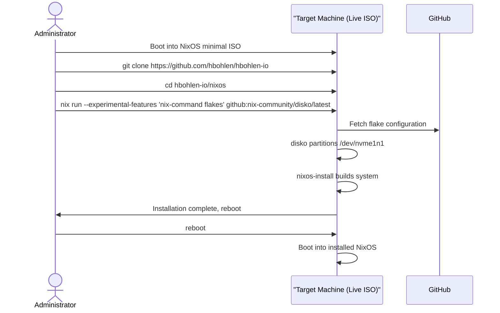
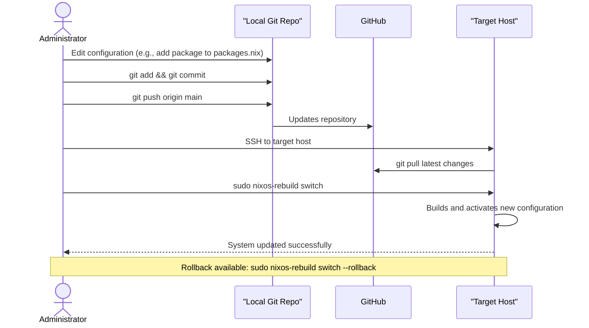
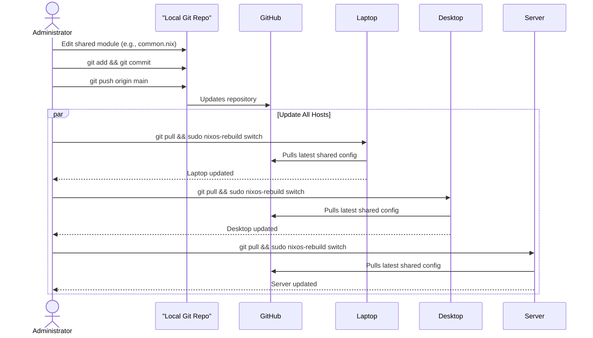

# 6. Core Workflows

## Workflow 1: System Installation (Implemented)

```mermaid
sequenceDiagram
    actor Administrator
    participant LiveISO as "Target Machine (Live ISO)"
    participant GitHub

    Administrator->>LiveISO: Boot into NixOS minimal ISO
    Administrator->>LiveISO: git clone https://github.com/hbohlen/hbohlen-io
    Administrator->>LiveISO: cd hbohlen-io/nixos
    Administrator->>LiveISO: nix run --experimental-features 'nix-command flakes' github:nix-community/disko/latest#disko-install -- --flake .#desktop --disk nvme1n1 /dev/nvme1n1

    LiveISO->>GitHub: Fetch flake configuration
    LiveISO->>LiveISO: disko partitions /dev/nvme1n1
    LiveISO->>LiveISO: nixos-install builds system
    LiveISO->>Administrator: Installation complete, reboot
    Administrator->>LiveISO: reboot
    LiveISO->>LiveISO: Boot into installed NixOS
```

## Workflow 2: System Updates (Implemented)

```mermaid
sequenceDiagram
    actor Administrator
    participant LocalRepo as "Local Git Repo"
    participant GitHub
    participant TargetHost as "Target Host"

    Administrator->>LocalRepo: Edit configuration (e.g., add package to packages.nix)
    Administrator->>LocalRepo: git add && git commit
    Administrator->>LocalRepo: git push origin main
    LocalRepo->>GitHub: Updates repository

    Administrator->>TargetHost: SSH to target host
    TargetHost->>GitHub: git pull latest changes
    Administrator->>TargetHost: sudo nixos-rebuild switch
    TargetHost->>TargetHost: Builds and activates new configuration
    TargetHost-->>Administrator: System updated successfully

    Note over Administrator,TargetHost: Rollback available: sudo nixos-rebuild switch --rollback
```

## Workflow 3: Multi-Host Configuration Updates

```mermaid
sequenceDiagram
    actor Administrator
    participant LocalRepo as "Local Git Repo"
    participant GitHub
    participant Laptop
    participant Desktop
    participant Server

    Administrator->>LocalRepo: Edit shared module (e.g., common.nix)
    Administrator->>LocalRepo: git add && git commit
    Administrator->>LocalRepo: git push origin main
    LocalRepo->>GitHub: Updates repository

    par Update All Hosts
        Administrator->>Laptop: git pull && sudo nixos-rebuild switch
        Laptop->>GitHub: Pulls latest shared config
        Laptop-->>Administrator: Laptop updated

        Administrator->>Desktop: git pull && sudo nixos-rebuild switch
        Desktop->>GitHub: Pulls latest shared config
        Desktop-->>Administrator: Desktop updated

        Administrator->>Server: git pull && sudo nixos-rebuild switch
        Server->>GitHub: Pulls latest shared config
        Server-->>Administrator: Server updated
    end
```

---