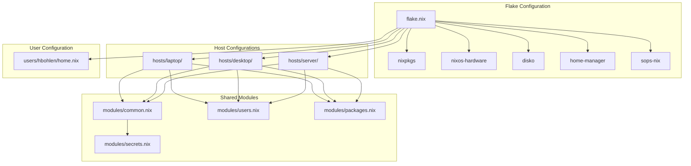
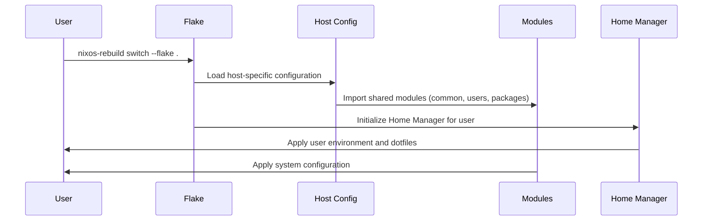
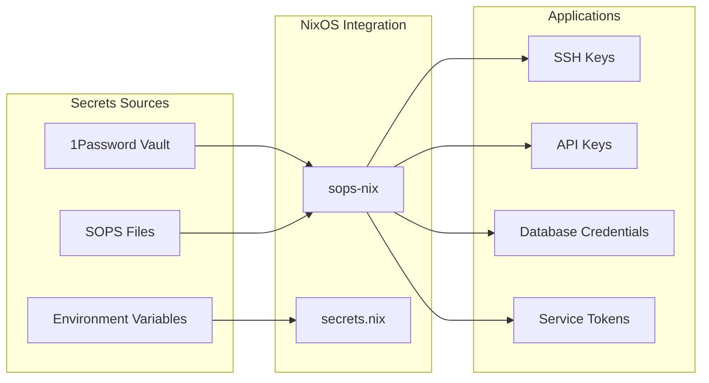
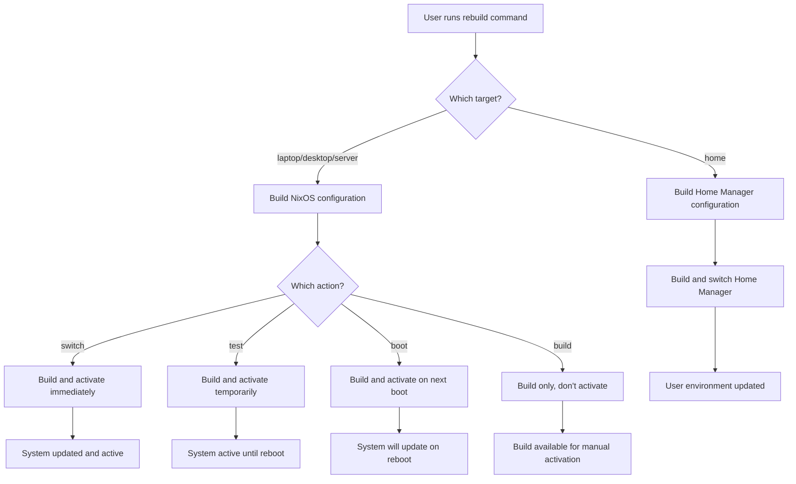

# NixOS Configuration

This directory contains a comprehensive NixOS configuration setup managed using Nix Flakes, featuring multi-host support, Home Manager integration, and centralized secrets management.

## Architecture Overview



## Directory Structure

```
nixos/
├── flake.nix                 # Main flake configuration with inputs and outputs
├── hosts/                    # Host-specific configurations
│   ├── laptop/               # ASUS Zephyrus M16 configuration
│   │   ├── configuration.nix # Main system configuration
│   │   └── disko.nix         # Disk partitioning (Btrfs on /dev/nvme0n1)
│   ├── desktop/              # Desktop workstation configuration
│   │   ├── configuration.nix # Desktop-specific settings (NVIDIA, etc.)
│   │   └── disko.nix         # Desktop disk configuration
│   └── server/               # Server configuration
│       ├── configuration.nix # Headless server settings
│       └── disko.nix         # Server disk configuration
├── modules/                  # Shared NixOS modules
│   ├── common.nix           # Common configuration for all hosts
│   ├── users.nix            # User account configuration
│   ├── packages.nix         # System-wide package definitions
│   └── secrets.nix          # Secrets management configuration
├── users/                   # Home Manager configurations
│   └── hbohlen/            # User-specific configuration
│       └── home.nix        # Home Manager setup with dotfiles and tools
└── README.md               # This documentation
```

## Configuration Flow



## Current Setup

### Hosts
- **laptop**: ASUS Zephyrus M16 (primary development machine)
- **desktop**: Workstation with NVIDIA graphics (multi-monitor setup)  
- **server**: Headless server (SSH access only)

### Key Features
- **Nixpkgs Version**: `nixos-unstable` for latest packages
- **Hardware Support**: `nixos-hardware` modules for ASUS-specific features
- **User Management**: Home Manager for user `hbohlen`
- **Disk Management**: Disko for declarative partitioning
- **Secrets**: sops-nix integration with 1Password CLI backend

## Usage

### Quick Commands

The configuration includes several aliases and functions for easy management:

```bash
# System rebuild aliases
nrs              # nixos-rebuild switch (current host)
nrt              # nixos-rebuild test (current host)
nrb              # nixos-rebuild boot (current host)

# Home Manager aliases
hms              # home-manager switch
hmt              # home-manager build

# Host-specific rebuild aliases
rebuild-laptop   # Rebuild laptop configuration
rebuild-desktop  # Rebuild desktop configuration  
rebuild-server   # Rebuild server configuration

# Universal rebuild function
rebuild laptop [switch|test|boot|build]   # Rebuild specific host
rebuild home                              # Rebuild home-manager only
```

### Building and Switching Configuration

From the repository root:

```bash
# Build and switch system configuration
sudo nixos-rebuild switch --flake ./nixos#laptop

# Test configuration without making it default
sudo nixos-rebuild test --flake ./nixos#laptop  

# Build configuration without switching
nixos-rebuild build --flake ./nixos#laptop

# Switch Home Manager configuration
home-manager switch --flake ./nixos#hbohlen
```

### Managing Flake Dependencies

```bash
# Update all inputs
cd nixos && nix flake update

# Update specific input
nix flake lock --update-input nixpkgs

# Show flake info
nix flake show

# Check flake for issues
nix flake check
```

## Host-Specific Features

### Laptop (ASUS Zephyrus M16)
- **Hardware Profile**: `asus-zephyrus-gu603h` from nixos-hardware
- **Battery Management**: 80% charge limit via `asus-battery` module
- **NVIDIA Graphics**: Hybrid graphics with proper kernel parameters
- **Services**: asusd daemon for hardware control, supergfxd for GPU switching
- **Virtualization**: Podman with Docker compatibility
- **Kernel**: Latest Linux kernel for best hardware support

### Desktop (Workstation)
- **Graphics**: NVIDIA with proper multi-monitor support
- **Audio**: PipeWire with full audio stack (ALSA, PulseAudio, JACK)
- **Virtualization**: libvirtd + Podman for containers and VMs
- **Hardware**: Intel CPU with microcode updates
- **Display**: X11 with GDM and GNOME

### Server (Headless)
- **Services**: OpenSSH with key-only authentication
- **Security**: No GUI, minimal attack surface
- **Access**: SSH-only access with proper firewall rules
- **Packages**: Essential server tools and monitoring utilities

## Home Manager Configuration

The Home Manager setup provides a consistent user environment across all hosts:

### Development Tools
- **Languages**: Python, Node.js, Go, Rust with development tools
- **Editors**: Neovim, VS Code with custom configurations  
- **Shell**: Zsh with oh-my-zsh, syntax highlighting, and autosuggestions
- **Version Control**: Git with sensible defaults and aliases
- **Terminal**: Tmux with custom configuration and key bindings

### Productivity Tools
- **File Management**: fd, ripgrep, bat, eza for enhanced CLI experience
- **System Monitoring**: htop, btop, fastfetch for system information
- **Cloud Tools**: AWS CLI, Google Cloud SDK, Azure CLI
- **Container Tools**: Docker, Podman with compose support

### Security and Secrets
- **Password Management**: 1Password CLI integration
- **Encryption**: SOPS, Age, GnuPG for secrets management
- **SSH**: Configured with proper key management

## Secrets Management

The configuration uses a hybrid approach for secrets management:

### Architecture


### Setup Process
1. **1Password CLI**: Install and authenticate with your vault
2. **Secret Retrieval**: Use provided scripts to fetch secrets
3. **SOPS Integration**: Encrypt secrets using sops-nix
4. **NixOS Application**: Reference secrets in configurations

### Secrets Configuration
The system handles various types of secrets:
- SSH private keys for remote access
- API keys for cloud services (GitHub, OpenAI, etc.)
- Database credentials and connection strings
- Service authentication tokens (Tailscale, Wireguard)
- Webhook secrets and API endpoints

## Rebuild Workflow



## Troubleshooting

### Common Issues

#### Build Failures
```bash
# Check flake syntax
nix flake check

# Build without switching to test
nixos-rebuild build --flake ./nixos#hostname

# Check system logs
journalctl -u nixos-rebuild
```

#### Home Manager Issues  
```bash
# Rebuild Home Manager configuration
home-manager switch --flake ./nixos#hbohlen

# Check Home Manager logs
journalctl --user -u home-manager-hbohlen
```

#### Hardware-Specific Problems
```bash
# NVIDIA driver issues
nvidia-smi                    # Check GPU status
journalctl -u display-manager # Check display manager logs

# ASUS hardware issues  
systemctl status asusd        # Check ASUS daemon
journalctl -u asusd           # View ASUS service logs
```

#### Network and SSH
```bash
# Test SSH configuration
sshd -T                       # Test SSH daemon config
ssh -T git@github.com         # Test Git SSH access

# Network troubleshooting
networkctl status             # Check network status
systemctl status NetworkManager
```

### Debug Commands
```bash
# System information
fastfetch                     # System overview
nixos-version                 # NixOS version info
nix --version                 # Nix version

# Configuration debugging
nixos-option system.stateVersion
home-manager packages | grep <package>

# Hardware debugging
lshw -short                   # Hardware summary  
lspci | grep -i nvidia        # Check NVIDIA hardware
lsusb                         # USB devices
```

## Adding New Hosts

To add a new host configuration:

1. **Create host directory**:
   ```bash
   mkdir -p hosts/newhost
   ```

2. **Create configuration files**:
   ```bash
   # hosts/newhost/configuration.nix
   { config, pkgs, ... }: {
     imports = [
       ../../modules/common.nix
       ../../modules/users.nix  
       ../../modules/packages.nix
     ];
     
     networking.hostName = "newhost";
     # Add host-specific configuration
   }
   
   # hosts/newhost/disko.nix  
   # Define disk partitioning scheme
   ```

3. **Update flake.nix**:
   ```nix
   outputs = { ... }: {
     nixosConfigurations = {
       # existing hosts...
       newhost = nixpkgs.lib.nixosSystem {
         inherit system;
         specialArgs = { inherit home-manager sops-nix; };
         modules = [
           disko.nixosModules.disko
           ./hosts/newhost/disko.nix
           ./hosts/newhost/configuration.nix
           # Add other modules as needed
         ];
       };
     };
   };
   ```

4. **Test configuration**:
   ```bash
   nixos-rebuild build --flake .#newhost
   ```

## Development Workflow

### Making Changes
1. Edit configuration files in your preferred editor
2. Test changes with `nixos-rebuild build --flake ./nixos#hostname`
3. Apply changes with `nixos-rebuild switch --flake ./nixos#hostname`
4. For Home Manager: `home-manager switch --flake ./nixos#hbohlen`

### Best Practices
- Always test with `build` before `switch`
- Use `test` for temporary changes that shouldn't persist across reboots
- Keep host-specific configurations minimal; use shared modules when possible
- Document hardware-specific quirks and workarounds
- Use semantic commit messages when tracking changes in git

### Configuration Philosophy
- **Declarative**: Everything is defined in configuration files
- **Reproducible**: Same inputs always produce the same outputs  
- **Modular**: Shared configuration via modules reduces duplication
- **Secure**: Secrets are properly managed and encrypted
- **Maintainable**: Clear structure and documentation for future changes

## Advanced Features

### Custom Modules
Create reusable configuration modules in the `modules/` directory:

```nix
# modules/my-service.nix
{ config, lib, pkgs, ... }:
with lib;
{
  options.services.my-service = {
    enable = mkEnableOption "My custom service";
    port = mkOption {
      type = types.int;
      default = 8080;
      description = "Port for my service";
    };
  };
  
  config = mkIf config.services.my-service.enable {
    # Service configuration
  };
}
```

### Overlays and Overrides
Customize packages using overlays in your configuration:

```nix
nixpkgs.overlays = [
  (self: super: {
    my-custom-package = super.my-package.override {
      # Custom build options
    };
  })
];
```

### Conditional Configuration
Use conditional logic for different environments:

```nix
config = lib.mkIf (config.networking.hostName == "laptop") {
  # Laptop-specific configuration
};
```

This NixOS configuration provides a solid foundation for a multi-host development and production environment with proper secrets management, hardware support, and user environment consistency.